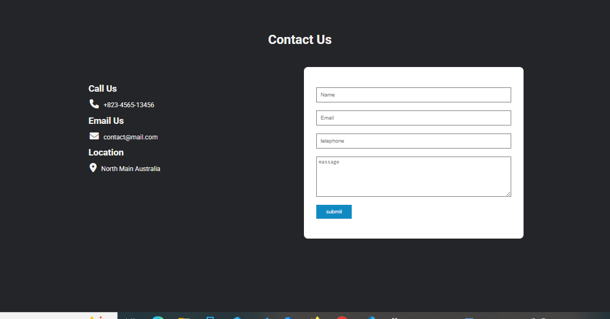
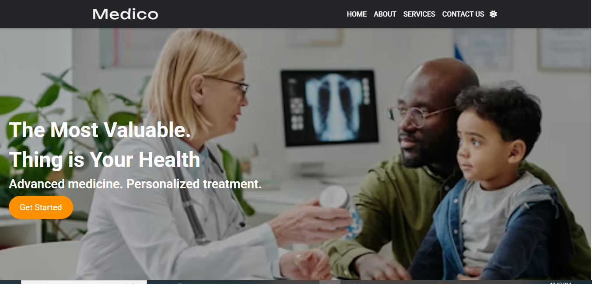
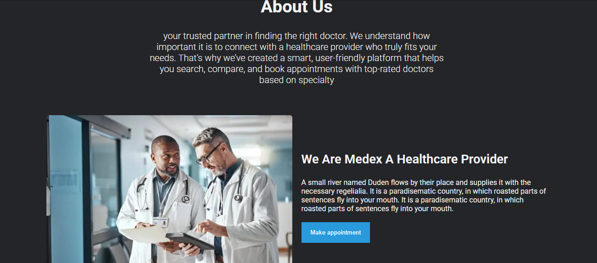
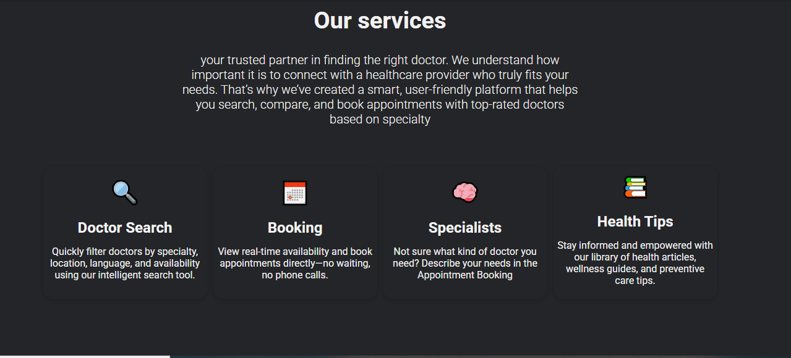
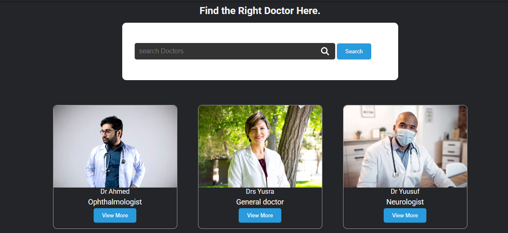
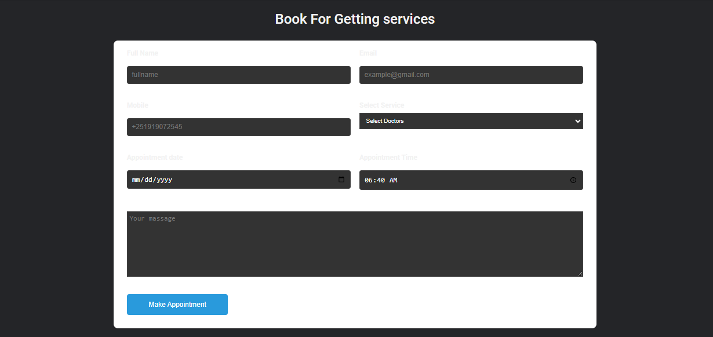
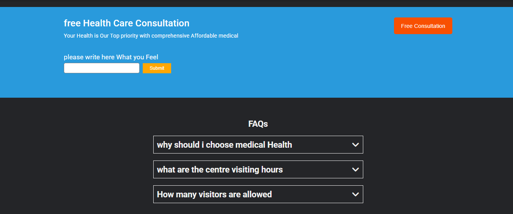

# 🩺 Medical Assistance Web App

A responsive and user-friendly healthcare web application that helps users **find doctors**, **book appointments**, and receive **health tips**—all in one place. This platform aims to improve healthcare access with a clean design, accessible features, and seamless user experience.

## 🌐 Live Demo

[Visit the Live Site](#) <!-- Replace with your deployed link -->

---

## 🚀 Features

- 🧑‍⚕️ Browse doctors by specialty
- 📅 Book medical appointments
- 💡 View daily health tips
- 🌙 Light and Dark mode toggle
- 🔎 Search functionality for doctors
- 🧠 Accessible design using semantic HTML and ARIA
- 🗃️ Persistent data using `localStorage`
- 🔌 Medical data fetched via third-party **Medical API**

---

## 🛠️ Technologies Used

- **HTML5** – Semantic and accessible structure
- **CSS3** / **Tailwind CSS** *(if used)* – Responsive and modern UI
- **JavaScript (ES6+)** – Dynamic interactions and logic
- **LocalStorage** – For persisting bookings and theme preferences
- **REST APIs** – To fetch real-time doctor or medical info

---

## 🧩 Possible Integrations

- **Infermedica** or **EndlessMedical** API for symptom checking
- **Twilio/Firebase WebRTC** for virtual consultation
- **Calendly API** for appointment scheduling

---

## 📷 Screenshots

<!-- Add screenshots of your homepage, booking UI, and dark/light themes -->
      

---

## 📁 How to Run Locally

```bash
git clone https://github.com/Sakariye-aden/finding-your-Doctor.git
cd medical-assist-app
open index.html